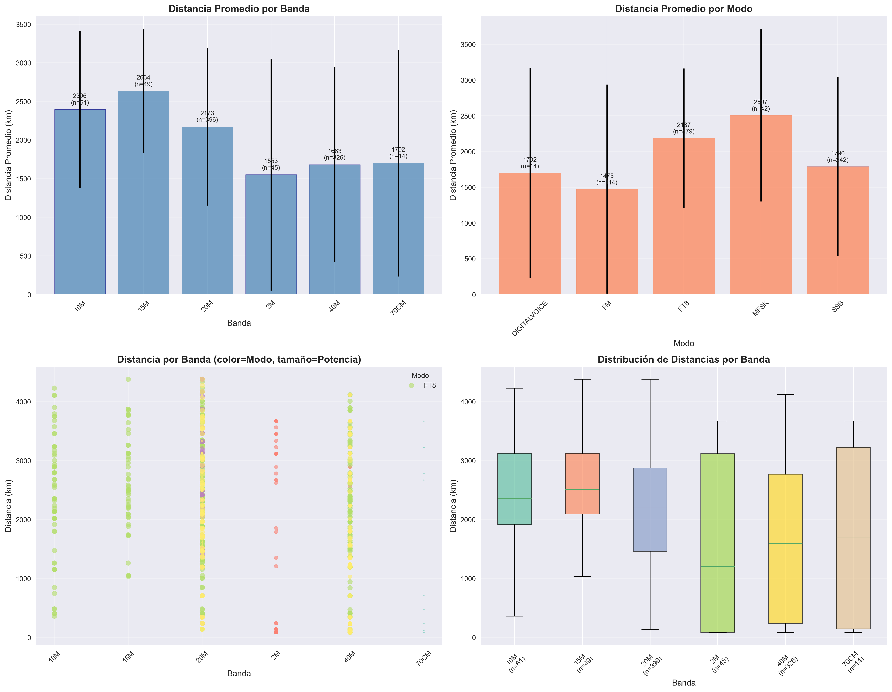

# 📻 Analizador de Logs ADIF para Radioaficionados


Scripts en Python para analizar archivos de log de radioaficionados en formato ADIF y generar gráficos estadísticos completos.

## 📋 Descripción

Este proyecto contiene dos scripts que generan **más de 30 gráficos estadísticos** a partir de archivos ADIF:

| Script | Descripción | Gráficos |
|--------|-------------|-----------|
| `analizar_adi_grafico.py` | Análisis general del log completo | 18 gráficos |
| `analizar_por_operador.py` | Análisis detallado por operador | 14 gráficos |

## 🚀 Uso Rápido

```bash
# ============================================
# 1. CONFIGURAR ENTORNO (solo la primera vez)
# ============================================
./setup_and_run.sh

# O manualmente:
python3 -m venv venv_adi
source venv_adi/bin/activate
pip install -r requirements.txt

# ============================================
# 2. EJECUTAR ANÁLISIS GENERAL (17 gráficos)
# ============================================
./run_analysis.sh

# O directamente:
python analizar_adi_grafico.py

# ============================================
# 3. EJECUTAR ANÁLISIS POR OPERADOR (14 gráficos)
# ============================================
source venv_adi/bin/activate
python analizar_por_operador.py
```

## 📁 Estructura del Proyecto

```
├── aaa.adi                          # Archivo ADIF de ejemplo (2,351 QSOs)
├── analizar_adi_grafico.py           # Script 1: Análisis general
├── analizar_por_operador.py          # Script 2: Análisis por operador
├── requirements.txt                  # Dependencias Python
├── setup_and_run.sh                 # Script: Setup + ejecutar análisis general
├── run_analysis.sh                  # Script: Ejecutar análisis general
├── estadisticas_adi.json            # Estadísticas en JSON
│
├── GRÁFICOS ANÁLISIS GENERAL (17):
│   ├── grafico_paises.png           # Top 15 países
│   ├── grafico_localizadores.png     # Top 20 localizadores Maidenhead
│   ├── grafico_modos_bandas.png     # Modos y bandas (4 subplots)
│   ├── grafico_estaciones_top.png   # Top 20 estaciones
│   ├── grafico_distribucion_horaria.png  # Actividad por hora
│   ├── grafico_mapa_mundial.png     # Dispersión mundial
│   ├── grafico_heatmap_dia_hora.png # Heatmap día/hora
│   ├── grafico_distancias.png       # Histograma de distancias
│   ├── grafico_zonas.png            # Zonas CQ e ITU
│   ├── grafico_timeline.png         # QSOs acumulados
│   ├── grafico_frecuencias.png      # Histograma frecuencias
│   ├── grafico_potencia_distancia.png  # Scatter potencia/distancia
│   ├── grafico_banda_modo.png       # Heatmap banda vs modo
│   ├── grafico_dxcc.png             # Top 20 DXCC
│   ├── grafico_dashboard.png        # Dashboard resumen (6 subplots)
│   ├── grafico_qrz_lookups.png      # Lookups en QRZ.com
│   └── grafico_fonia_por_hora.png   # Fonía por hora UTC
│
└── GRÁFICOS ANÁLISIS POR OPERADOR (14):
    ├── operador_resumen.png          # Comparativa total QSOs
    ├── operador_bandas.png          # Bandas por operador (heatmap)
    ├── operador_modos.png           # Modos por operador (heatmap)
    ├── operador_horas.png           # Actividad horaria por operador
    ├── operador_comparacion_bandas.png  # Barras agrupadas bandas
    ├── operador_comparacion_modos.png   # Barras agrupadas modos
    ├── operador_EA1JBW.png          # Detalle individual EA1JBW
    ├── operador_EA3JAQ.png          # Detalle individual EA3JAQ
    ├── operador_EA4GHH.png          # Detalle individual EA4GHH
    ├── operador_EA4HUK.png          # Detalle individual EA4HUK
    ├── operador_EA7GSP.png          # Detalle individual EA7GSP
    ├── operador_EA7LDI.png          # Detalle individual EA7LDI
    ├── operador_EA7LHS.png          # Detalle individual EA7LHS
    └── operador_EB4GSN.png          # Detalle individual EB4GSN
```

---

## 📈 Script 1: Análisis General (17 gráficos)

### Gráficos Básicos

#### 1. Distribución por Países


Top 15 países contactados con barras y distribución porcentual.

#### 2. Localizadores Maidenhead


Top 20 cuadrículas Maidenhead más contactadas.

#### 3. Modos y Bandas


Análisis de modos (SSB, FT8, FM, DIGITALVOICE, MFSK) y bandas (40M, 20M, 70cm).

#### 4. Top Estaciones


Estaciones más contactadas por número de QSOs.

#### 5. Distribución Horaria General


Patrón de actividad por hora UTC para todos los modos.

---

### Gráficos Avanzados

#### 6. Mapa Mundial de Localizadores


Dispersión geográfica de localizadores Maidenhead.

#### 7. Heatmap Día/Hora


Actividad semanal: días y horas de mayor operación.

#### 8. Distribución de Distancias


Histograma lineal y logarítmico de distancias en km.

| Métrica | Valor |
|---------|-------|
| Distancia media | 2,129 km |
| Distancia máxima | 19,765 km |

#### 9. Distancias por Localizador (Banda, Modo y Potencia)


Análisis de distancias calculadas entre emisor y receptor:
- **Gráfico 1:** Distancia promedio por banda con desviación estándar
- **Gráfico 2:** Distancia promedio por modo de operación
- **Gráfico 3:** Scatter plot mostrando distancia por banda (color=modo, tamaño=potencia)
- **Gráfico 4:** Box plot de distribución de distancias por banda

Calcula la distancia usando los localizadores Maidenhead del operador (MY_GRIDSQUARE) y del contacto (GRIDSQUARE).

#### 10. Zonas CQ e ITU


Distribución de contactos por zonas geográficas internacionales.

#### 11. Timeline de QSOs


Progreso acumulado de contactos y QSOs por día.

#### 12. Frecuencias Usadas


Histograma de frecuencias exactas en MHz.

#### 13. Potencia vs Distancia


Scatter plot y mapa de densidad potencia/distancia.

#### 14. Heatmap Banda vs Modo


Matriz banda-modo con valores en cada celda.

#### 15. Entidades DXCC


Top 20 entidades DXCC (países reconocidos por ARRL).

#### 16. Dashboard Resumen


Vista consolidada con 6 subplots: países, modos, bandas, estaciones, horario y distancias.

---

### Gráficos Especiales

#### 17. QRZ.com Lookups


Correlación entre contactos y número de lookups en QRZ.com.

| Indicativo | Lookups | Contactos |
|------------|---------|-----------|
| EA8CWA | 83,483 | 9 |
| EA8AE | 71,971 | 6 |
| EA5NA | 69,523 | 10 |
| EA5FHC | 48,780 | 7 |
| EA4HNO | 19,404 | 12 |

#### 18. Fonía por Hora


Análisis específico de contactos en fonía (SSB/FM) por hora UTC.

| Métrica | Valor |
|---------|-------|
| Total QSOs fonía | 1,250 |
| Hora pico | 18:00 UTC |
| QSOs en hora pico | 231 |

---

## 👥 Script 2: Análisis por Operador (14 gráficos)

Agrupa los contactos por el campo `OPERATOR` y genera estadísticas individuales y comparativas.

### Operadores Encontrados

| Operador | Total QSOs | Banda Favorita | Modo Favorito | Hora Pico |
|----------|-----------|----------------|---------------|-----------|
| **EA4HUK** | 742 | 40M (524) | SSB (570) | 11:00 UTC |
| **EB4GSN** | 622 | 20M (347) | FT8 (543) | 07:00 UTC |
| **EA7LDI** | 259 | 40M (219) | FT8 (144) | 18:00 UTC |
| **EA7LHS** | 254 | 40M (107) | SSB (140) | 16:00 UTC |
| **EA4GHH** | 240 | 40M (194) | SSB (125) | 10:00 UTC |
| **EA3JAQ** | 113 | 20M (57) | SSB (59) | 20:00 UTC |
| **EA1JBW** | 103 | 20M (84) | SSB (103) | 18:00 UTC |
| **EA7GSP** | 18 | 70CM (18) | DIGITALVOICE (18) | 21:00 UTC |

### Gráficos Comparativos

#### Resumen por Operador


Total de QSOs y distribución porcentual por operador.

#### Bandas por Operador


Heatmap y barras mostrando qué bandas usa cada operador.

#### Modos por Operador


Análisis de modos por operador con heatmap.

#### Actividad Horaria por Operador


Heatmap y líneas de tendencia horaria.

#### Comparación de Bandas


Barras agrupadas comparando bandas entre operadores.

#### Comparación de Modos


Barras agrupadas comparando modos entre operadores.

### Gráficos Individuales (4 subplots cada uno)

Cada operador tiene su propio gráfico con: Bandas, Modos (pastel), Actividad horaria, Días de la semana.

| EA1JBW | EA3JAQ | EA4GHH |
|--------|--------|--------|
|  |  |  |

| EA4HUK | EA7GSP | EA7LDI |
|--------|--------|--------|
|  |  |  |

| EA7LHS | EB4GSN |
|--------|--------|
|  |  |

---

## 📊 Estadísticas del Log de Ejemplo

```
Total QSOs analizados:     2,351
Operadores únicos:         8
Países contactados:       45
Localizadores únicos:     367
Estaciones únicas:       1,775
Zonas CQ únicas:          8
Zonas ITU únicas:         8
Distancia media:      2,129 km
Distancia máxima:     19,765 km

Modos utilizados:
  - SSB (Fonía): 1,250 QSOs
  - FT8 (Digital)
  - FM
  - DIGITALVOICE
  - MFSK

Bandas utilizadas:
  - 40M, 20M, 15M, 10M (HF)
  - 2M, 70cm (VHF/UHF)
```

---

## 🔧 Personalización

### Cambiar archivo de entrada

Edita la variable `filename` en ambos scripts:

```python
def main():
    filename = 'tu_archivo.adi'  # Cambiar aquí
```

### Agregar más datos de QRZ Lookups

Edita `create_qrz_lookups_chart()` en `analizar_adi_grafico.py`:

```python
lookups_data = {
    'TUIndicATIVO': {'lookups': 12345, 'contactos': 5},  # Añadir aquí
}
```

### Añadir nuevos gráficos

Agregar función `create_nuevo_grafico()` y llamarla desde `generate_statistics_report()`.

---

## 📦 Dependencias

```
matplotlib>=3.5.0
seaborn>=0.11.0
pandas>=1.3.0
numpy>=1.21.0
```

Instalación: `pip install -r requirements.txt`

---

## 📖 Campos ADIF Soportados

| Campo | Descripción |
|-------|-------------|
| CALL | Indicativo de la estación |
| COUNTRY | País |
| OPERATOR | Operador que realizó el contacto |
| FREQ | Frecuencia (MHz) |
| BAND | Banda |
| MODE | Modo |
| TX_PWR | Potencia (W) |
| GRIDSQUARE | Locator Maidenhead |
| QSO_DATE | Fecha (YYYYMMDD) |
| TIME_ON | Hora (HHMM UTC) |
| DISTANCE | Distancia (km) |
| CQZ | Zona CQ |
| ITUZ | Zona ITU |
| NAME | Nombre del operador |
| RST_RCVD/SENT | Reporte RST |

---

## 🎓 Formato ADIF

El script maneja automáticamente:
- Codificación UTF-8, Latin-1, CP1252, ISO-8859-1
- Formato `NOMBRE:LONGITUD>valor` (estándar ADIF 3.x)
- Registros con `EOH` (header) y `EOR` (fin de registro)

---

## 📝 Licencia

MIT License - Libre para uso y modificación.

---

*Generado con analizar_adi_grafico.py y analizar_por_operador.py*
*Para EA1JBW/AM26PADRE* 🇪🇸
