# 📻 Analizador de Logs ADIF para Radioaficionados


Script en Python para analizar archivos de log de radioaficionados en formato ADIF y generar gráficos estadísticos completos.

## 📋 Descripción

Este proyecto parsea archivos ADIF (Amateur Data Interchange Format) y genera automáticamente múltiples gráficos y estadísticas de los contactos de radioaficionado:

- 📊 Distribución por países, bandas y modos
- 🌍 Mapa mundial de localizadores Maidenhead
- ⏰ Análisis temporal (hora, día, progreso)
- 📡 Fonía vs digitales
- 🔍 Correlación con datos de QRZ.com

## 🚀 Uso Rápido

```bash
# Opción 1: Setup completo (crea entorno virtual + instala + ejecuta)
./setup_and_run.sh

# Opción 2: Solo ejecutar (usa entorno existente)
./run_analysis.sh
```

## 📁 Estructura del Proyecto

```
├── aaa.adi                    # Archivo ADIF de ejemplo (2,351 QSOs)
├── analizar_adi_grafico.py    # Script principal (documentado)
├── requirements.txt           # Dependencias Python
├── setup_and_run.sh          # Script de instalación y ejecución
├── run_analysis.sh           # Script de ejecución rápida
└── README.md                  # Este archivo
```

## 📈 Gráficos Generados

### Gráficos Básicos

#### 1. Distribución por Países
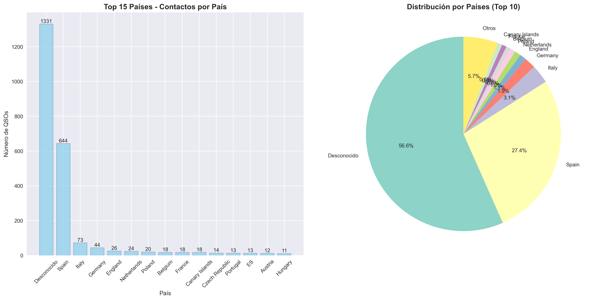

Top 15 países contactados con gráfico de barras y distribución porcentual.

#### 2. Localizadores Maidenhead
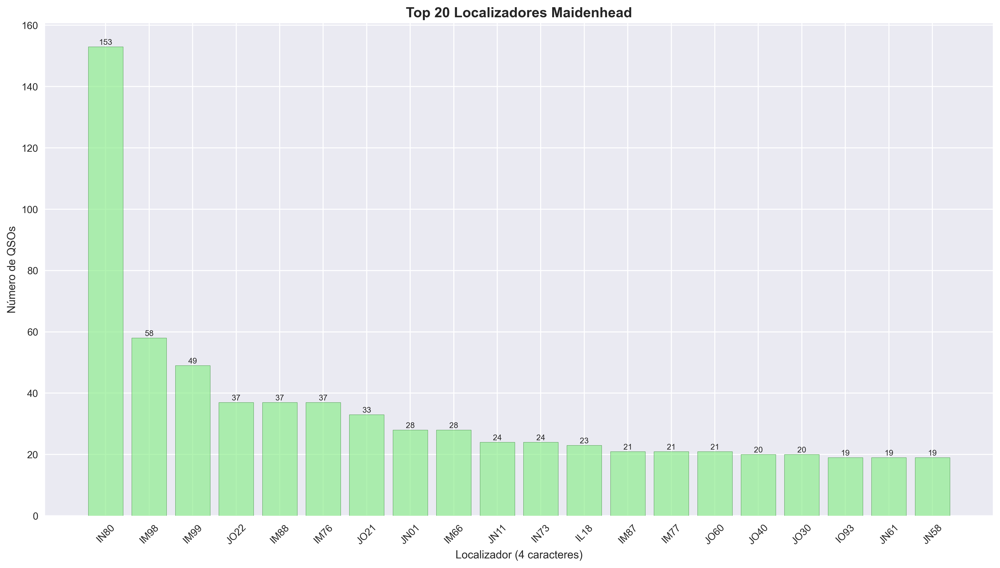

Top 20 cuadrículas Maidenhead más contactadas.

#### 3. Modos y Bandas
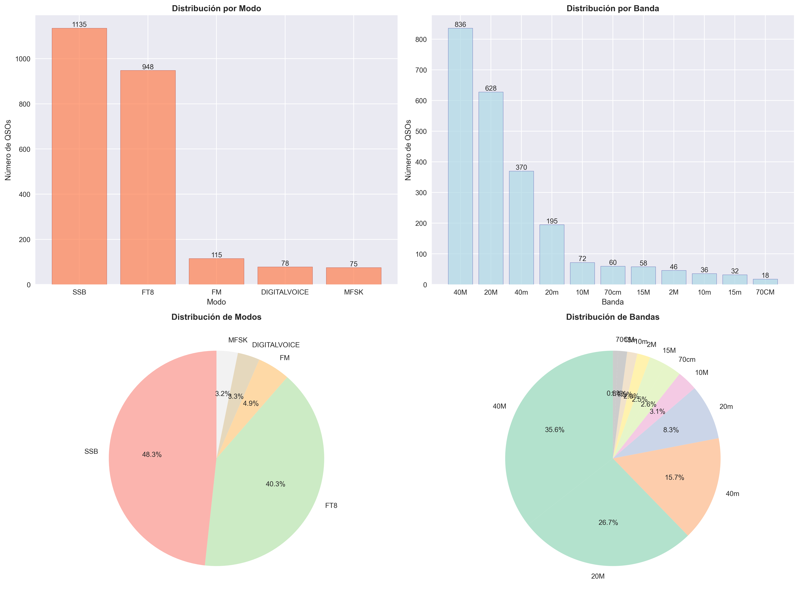

Análisis cruzado de modos de operación (SSB, FT8, FM, DIGITALVOICE, MFSK) y bandas (40M, 20M, 70cm).

#### 4. Top Estaciones
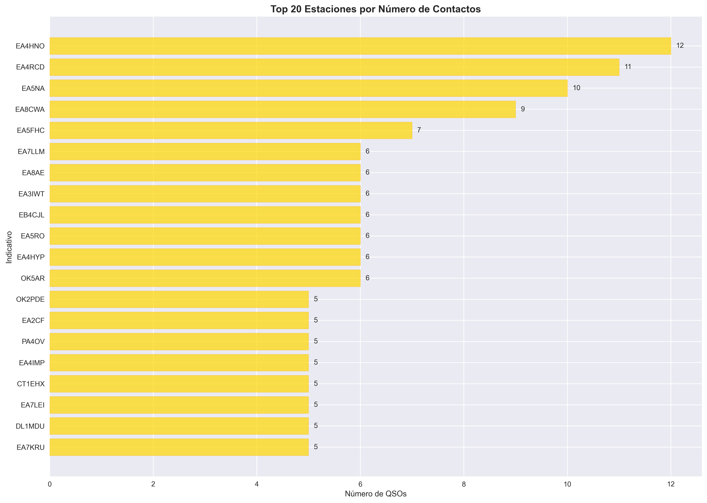

Estaciones más contactadas con número de QSOs por indicativo.

#### 5. Distribución Horaria General
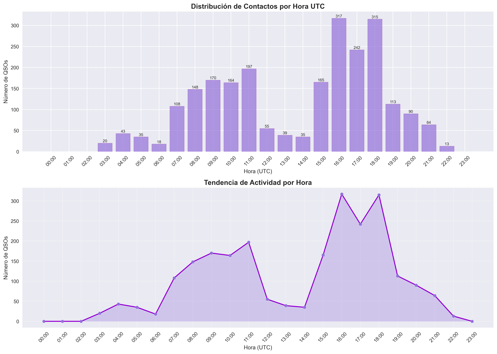

Patrón de actividad por hora UTC para todos los modos.

---

### Gráficos Avanzados

#### 6. Mapa Mundial de Localizadores
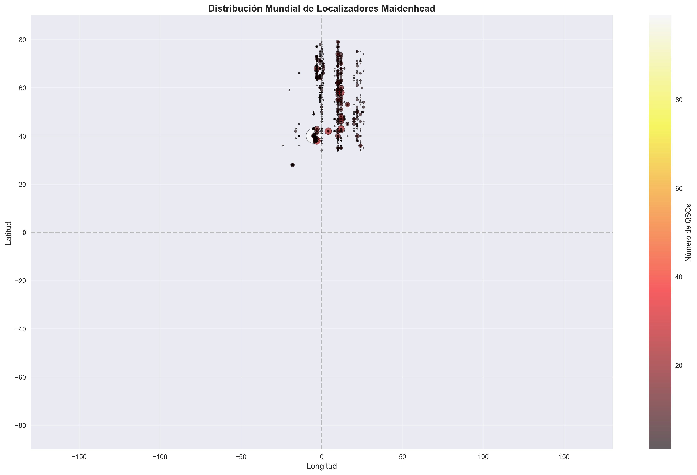

Dispersión geográfica de todos los localizadores Maidenhead contactados.

#### 7. Heatmap Día/Hora
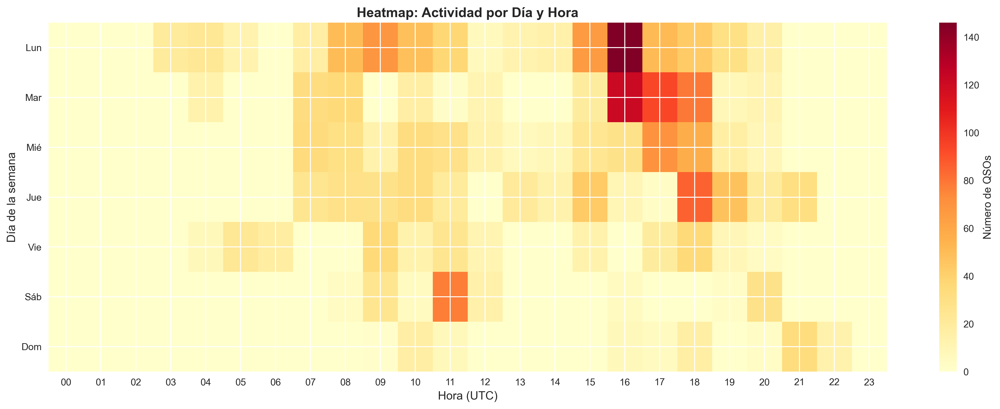

Actividad semanal: identifica días y horas de mayor operación.

#### 8. Distribución de Distancias
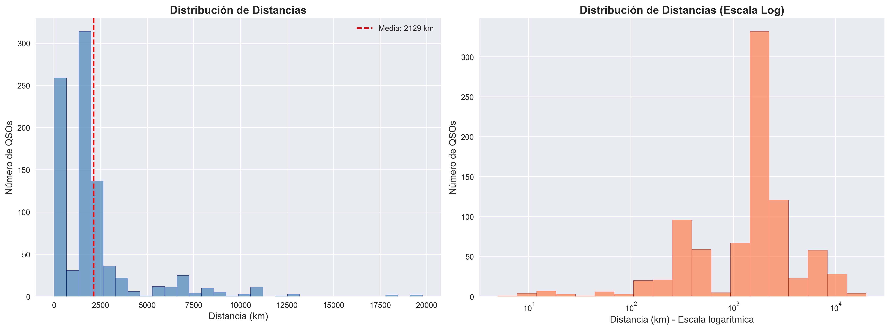

Histograma lineal y logarítmico de distancias en km.

| Métrica | Valor |
|---------|-------|
| Distancia media | 2,129 km |
| Distancia máxima | 19,765 km |

#### 9. Zonas CQ e ITU
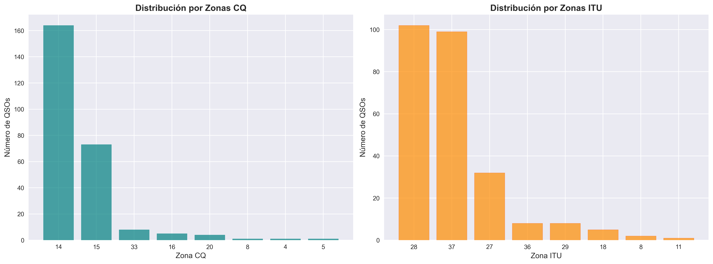

Distribución de contactos por zonas geográficas internacionales.

#### 10. Timeline de QSOs
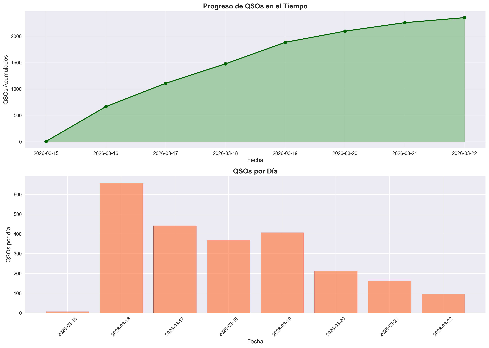

Progreso acumulado de contactos y QSOs por día.

#### 11. Frecuencias Usadas
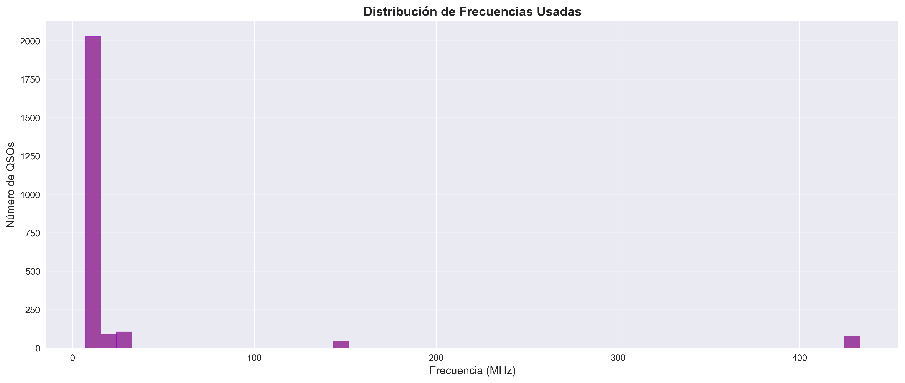

Histograma de frecuencias exactas en MHz.

#### 12. Potencia vs Distancia
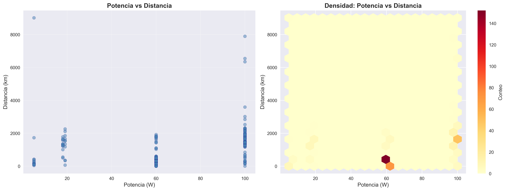

Scatter plot y mapa de densidad mostrando relación entre potencia TX y distancia.

#### 13. Heatmap Banda vs Modo
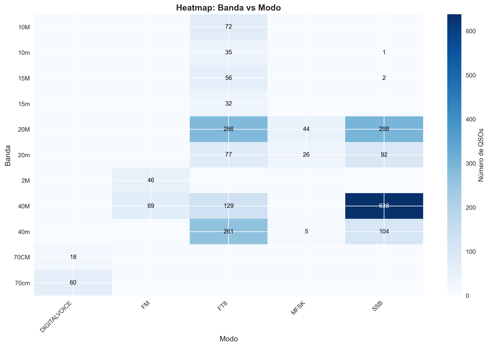

Matriz interactiva banda-modo con valores en cada celda.

#### 14. Entidades DXCC
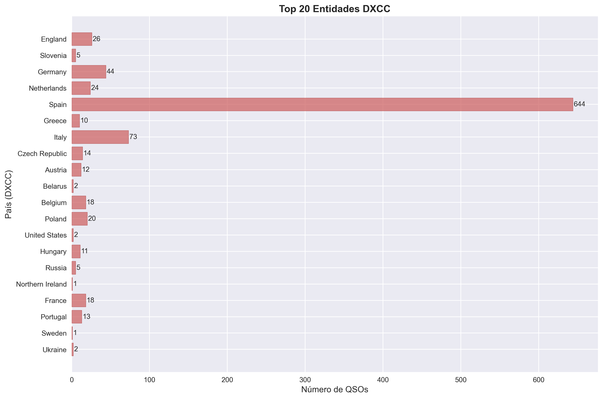

Top 20 entidades DXCC (países reconocidos por ARRL).

#### 15. Dashboard Resumen
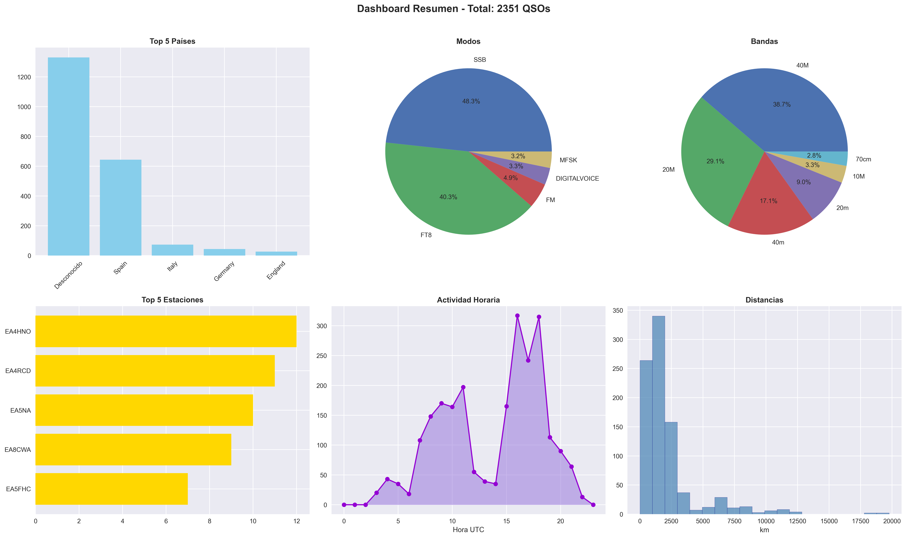

Vista consolidada con 6 subplots: países, modos, bandas, estaciones, horario y distancias.

---

### Gráficos Especiales

#### 16. QRZ.com Lookups
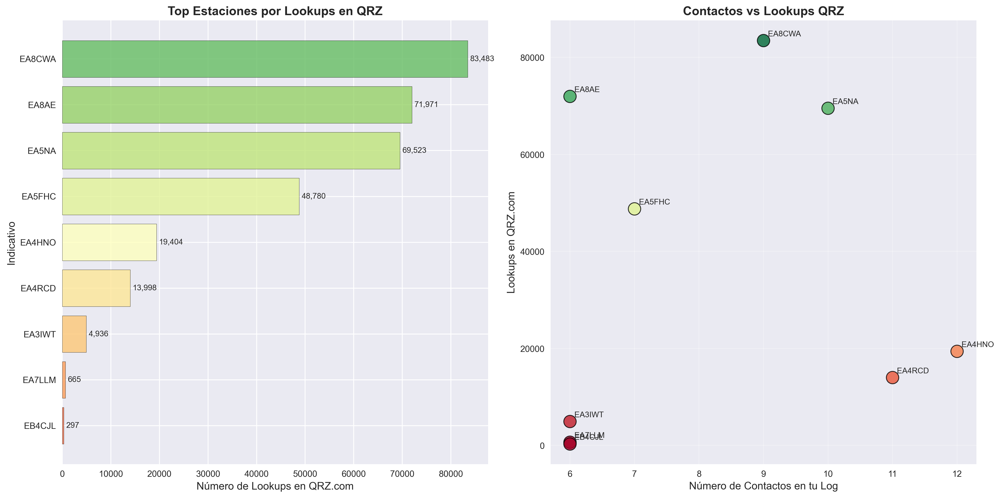

Correlación entre contactos en el log y número de lookups en QRZ.com.

| Indicativo | Lookups | Contactos |
|------------|---------|-----------|
| EA8CWA | 83,483 | 9 |
| EA8AE | 71,971 | 6 |
| EA5NA | 69,523 | 10 |
| EA5FHC | 48,780 | 7 |
| EA4HNO | 19,404 | 12 |

#### 17. Fonía por Hora
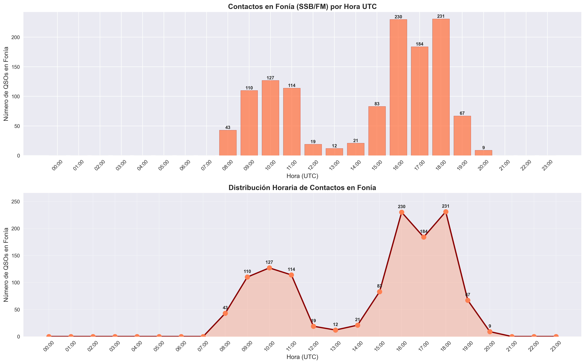

Análisis específico de contactos en fonía (SSB/FM) por hora UTC.

| Métrica | Valor |
|---------|-------|
| Total QSOs fonía | 1,250 |
| Hora pico | 18:00 UTC |
| QSOs en hora pico | 231 |

---

## 📊 Estadísticas del Log de Ejemplo

```
Total QSOs analizados:     2,351
Países contactados:       45
Localizadores únicos:      367
Estaciones únicas:       1,775
Zonas CQ únicas:           8
Zonas ITU únicas:          8
Distancia media:       2,129 km
Distancia máxima:      19,765 km

Modos utilizados:
  - SSB (Fonía)
  - FT8 (Digital)
  - FM
  - DIGITALVOICE
  - MFSK

Bandas utilizadas:
  - 40M, 20M, 15M, 10M (HF)
  - 2M, 70cm (VHF/UHF)
```

## 🔧 Personalización

### Agregar más datos de QRZ Lookups

Edita la función `create_qrz_lookups_chart()` en `analizar_adi_grafico.py`:

```python
lookups_data = {
    'TUIndicATIVO': {'lookups': 12345, 'contactos': 5},  # Añadir aquí
}
```

### Cambiar archivo de entrada

Edita la variable `filename` en la función `main()`:

```python
def main():
    filename = 'tu_archivo.adi'  # Cambiar aquí
```

### Añadir nuevos gráficos

Agregar una nueva función `create_nuevo_grafico()` y llamarla desde `generate_statistics_report()`.

## 📦 Dependencias

```
matplotlib>=3.5.0
seaborn>=0.11.0
pandas>=1.3.0
numpy>=1.21.0
```

Instalación: `pip install -r requirements.txt`

## 📖 Campos ADIF Soportados

| Campo | Descripción |
|-------|-------------|
| CALL | Indicativo |
| COUNTRY | País |
| FREQ | Frecuencia (MHz) |
| BAND | Banda |
| MODE | Modo |
| TX_PWR | Potencia (W) |
| GRIDSQUARE | Locator Maidenhead |
| QSO_DATE | Fecha (YYYYMMDD) |
| TIME_ON | Hora (HHMM UTC) |
| DISTANCE | Distancia (km) |
| CQZ | Zona CQ |
| ITUZ | Zona ITU |
| NAME | Nombre operador |
| RST_RCVD/SENT | Reporte RST |

## 🎓 Formato ADIF

El script maneja automáticamente:
- Codificación UTF-8, Latin-1, CP1252, ISO-8859-1
- Formato `NOMBRE:LONGITUD>valor` (estándar ADIF 3.x)
- Registros con `EOH` (header) y `EOR` (fin de registro)

## 📝 Licencia

MIT License - Libre para uso y modificación.

---

*Generado con analizar_adi_grafico.py para EA1JBW/AM26PADRE* 🇪🇸
